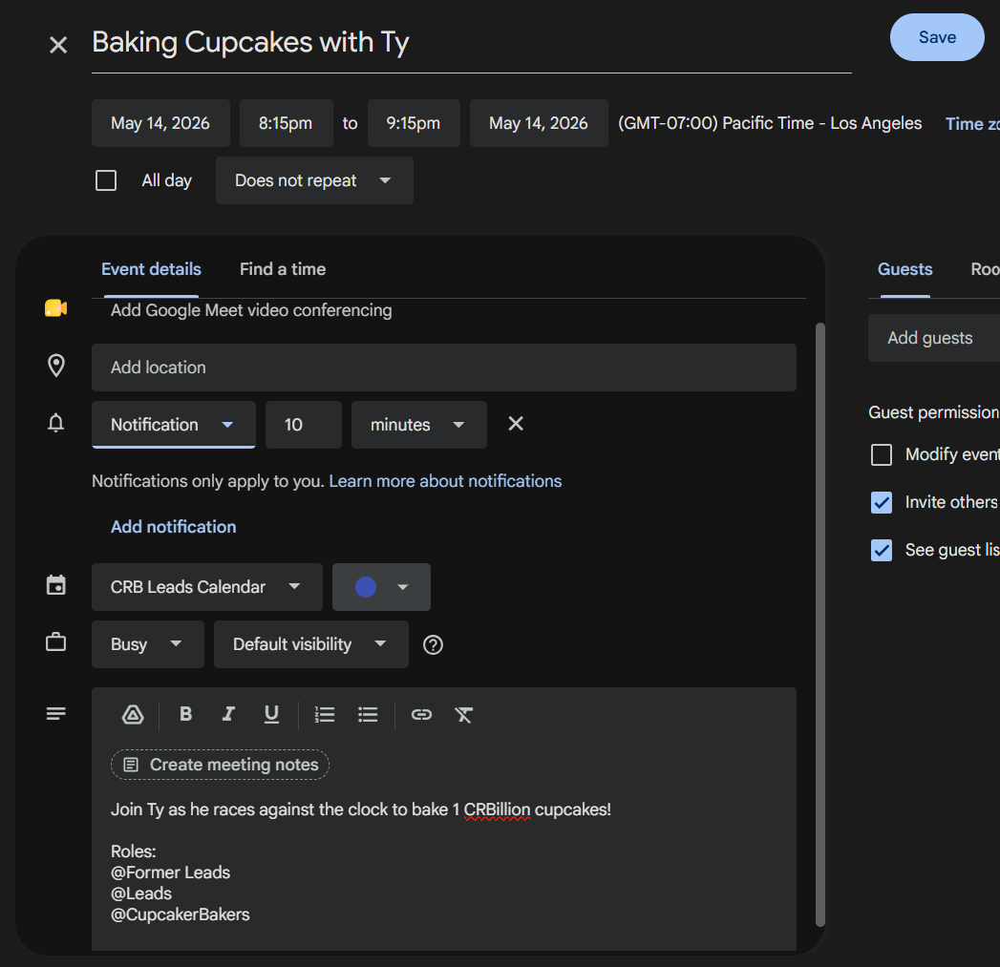
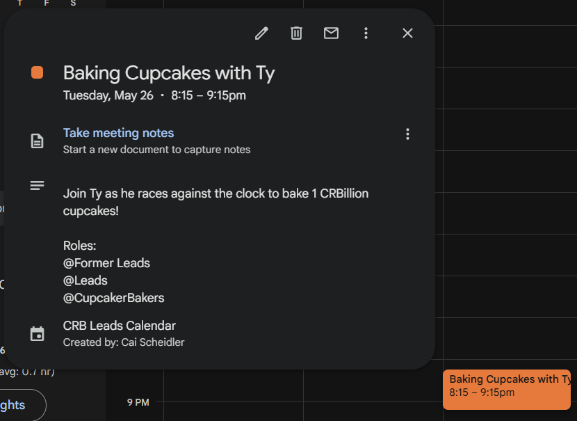
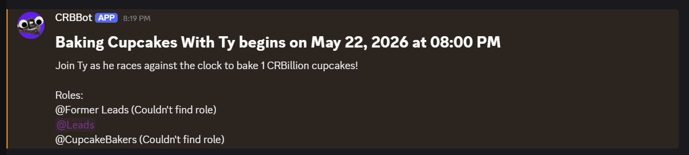

# CRBBot

a discord bot for CRB's discord server.

## Google Calendar Setup

### Which Google Calendars does CRBBot read from?
CRBBot currently reads from the Google Calendars linked below:

#### [Leads Google Calendar](https://calendar.google.com/calendar/embed?src=7cbcd686b423d31264c3d44533b4df1c13e9295c838984a6fe44903bc9efc623%40group.calendar.google.com&ctz=America%2FLos_Angeles)

#### [General Google Calenar](https://calendar.google.com/calendar/embed?src=piamd5t3aboib6g98k468o4uds%40group.calendar.google.com&ctz=America%2FLos_Angeles)
---

### What is CRBBot looking for in Google Calendar events?
CRBBot is setup to parse events with the following format:

Title: 
``` Put Event Title Here (can be anything) ```

Description: 
``` 
This is the event description, you can write anything here to describe the event.

Roles:
@Role 1
@Role 2
@Role 3
```
> You can ping as many roles as you want so long as each has its own line.

#### Example Event
Title: 
``` Baking Cupcakes with Ty ```

Description:
```
Join Ty as he races against the clock to bake 1 CRBillion cupcakes!

Roles:
@Former Leads
@Leads
@CupcakeBakers
```

Here is what this example event looks like in various places:



> Creating "Baking Cupcakes with Ty" on Google Calendar




> Viewing "Baking Cupcakes with Ty" on Google Calendar




> Viewing "Baking Cupcakes with Ty" on Discord


---

## Slash Commands

### Pages
Pages allow for the storing and retrieval of any pages of text within the server. Saving/deleting pages require a permitted role.

`/view_page <name>` -> Display a saved page 
 `/save_page <name> <text>`-> Create or overwrite a page
 `/del_page <name>` -> Delete a page 
 `/list_pages` -> List all saved page names 

```
/view_page name:onboarding
/save_page name:onboarding text:Welcome to CRB! Here's how to get started...
/del_page name:onboarding
/list_pages
```

---

### Events
CRBBot is integrated with Google Calendar to ping channels before events start.

`/set_lead_calendar_channel` -> Sets the current channel as the channel where Lead Calendar pings are sent.

`/set_general_calendar_channel` -> Sets the current channel as the channel where General Calendar pings are sent.

```
/set_lead_calendar_channel
/set_general_calendar_channel
```

> CRBBot will ping a channel ~1 minute prior to any event on that channel's associated Google Calendar.

---

### Reminders

`/remind <delay> <remindees> <message>` -> Remind one or more mentioned users after a delay 
`/remindme <delay> <message>` -> Remind yourself after a delay 

Delay format: combine `w` (weeks), `d` (days), `h` (hours), `m` (minutes), `s` (seconds).

```
/remind delay:1h30m remindees:@Kyler @Ty message:Kyler please pay back Ty's money
/remindme delay:2d message:Order motor controllers and ESCs
/remindme delay:45s message:If I'm alive to see this reminder then the test box didn't blow up
```

## CRBBot Setup (On the Raspberry Pi 0)

### Important Info
rasberry pi 0 ip: 192.168.50.107 (ip subject to change when we go back to Berkeley)

user: combatroboticsberkeley

pass: REDACTED (nice try)

---

### Setup 
to ssh into it do ```ssh combatroboticsberkeley@192.168.50.107``` from a cmd and sign in (might need to press enter a couple times after entering password)

then navigate to github_repos/CRBBot (can do ```cd github_repos/CRBBot```)

then run ```source env/bin/activate``` to enter virtual env

then run ```python3 CRBBot.py``` to start the bot

when done, run ```sudo shutdown -h now``` to shut the raspberry pi 0 down before unplugging it

---

### Other Helpful Commands
```deactivate``` exits you from the virtual environment (in Python) 

```exit``` exits you from being ssh'ed

---
